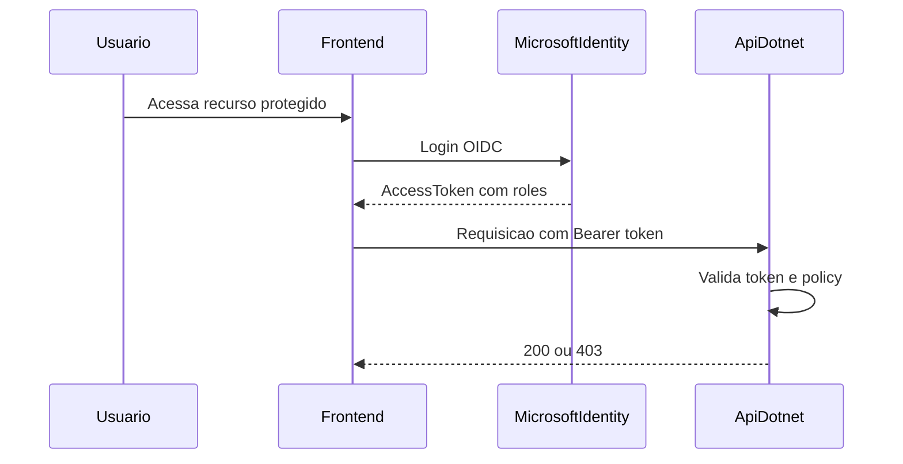
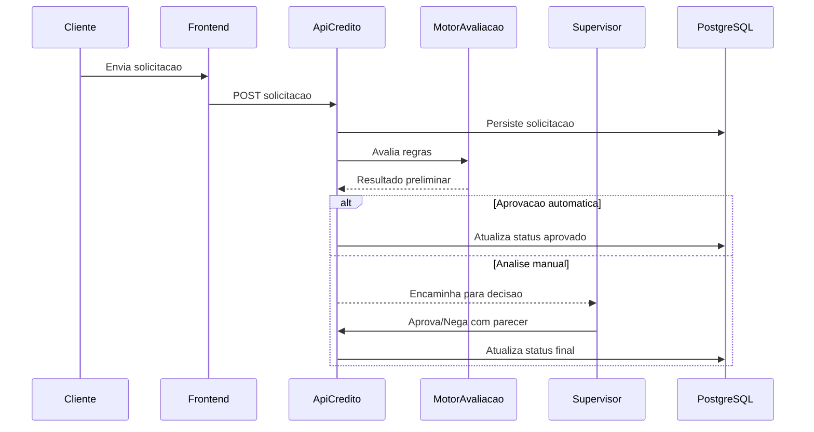
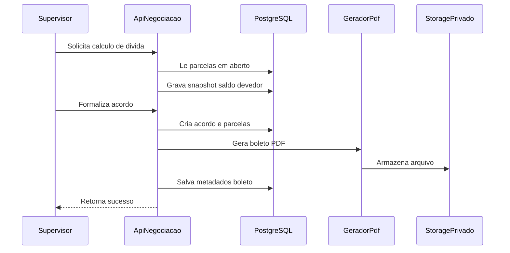

# Diagramas de Sequencia

## 1) Auth + Acesso RBAC

```mermaid
sequenceDiagram
    participant U as Usuario
    participant FE as Frontend
    participant IDP as MicrosoftIdentity
    participant API as ApiDotnet

    U->>FE: Acessa recurso protegido
    FE->>IDP: Login OIDC
    IDP-->>FE: AccessToken com roles
    FE->>API: Requisicao com Bearer token
    API->>API: Valida token e policy
    API-->>FE: 200 ou 403
```

## 2) Solicitacao e Avaliacao de Credito

```mermaid
sequenceDiagram
    participant C as Cliente
    participant FE as Frontend
    participant API as ApiCredito
    participant ENG as MotorAvaliacao
    participant SUP as Supervisor
    participant DB as PostgreSQL

    C->>FE: Envia solicitacao
    FE->>API: POST solicitacao
    API->>DB: Persiste solicitacao
    API->>ENG: Avalia regras
    ENG-->>API: Resultado preliminar
    alt Aprovacao automatica
        API->>DB: Atualiza status aprovado
    else Analise manual
        API-->>SUP: Encaminha para decisao
        SUP->>API: Aprova/Nega com parecer
        API->>DB: Atualiza status final
    end
```

## 3) Calculo de Divida + Acordo + Boleto

```mermaid
sequenceDiagram
    participant SUP as Supervisor
    participant API as ApiNegociacao
    participant DB as PostgreSQL
    participant PDF as GeradorPdf
    participant ST as StoragePrivado

    SUP->>API: Solicita calculo de divida
    API->>DB: Le parcelas em aberto
    API->>DB: Grava snapshot saldo devedor
    SUP->>API: Formaliza acordo
    API->>DB: Cria acordo e parcelas
    API->>PDF: Gera boleto PDF
    PDF->>ST: Armazena arquivo
    API->>DB: Salva metadados boleto
    API-->>SUP: Retorna sucesso
```
