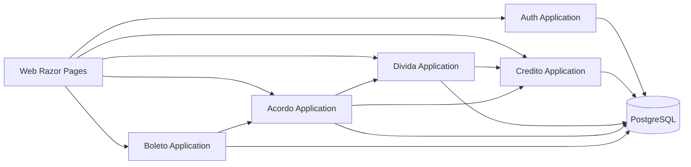

# Visao Arquitetural

## Estilo Arquitetural

Monolito modular em .NET 10, com modulos de dominio isolados por contratos internos:
- Auth
- Credito
- Divida
- Acordo
- Boleto
- Shared
- Web

## Stack

- **Backend:** ASP.NET Core 10
- **Persistencia:** PostgreSQL + Entity Framework Core
- **AuthN/AuthZ:** Microsoft Identity + RBAC
- **Frontend:** Razor Pages + Bulma CSS
- **Documentos PDF:** geracao com biblioteca PDF + armazenamento privado

## Diagrama Logico

## Decisoes Arquiteturais Principais

1. Monolito modular para reduzir complexidade operacional no MVP.
2. EF Core + PostgreSQL para produtividade e rastreabilidade.
3. RBAC com Microsoft Identity para controle de acesso por papel.
4. Servico de PDF sem CDN para cumprir restricao do contexto.
5. TDD como criterio obrigatorio desde o inicio.
