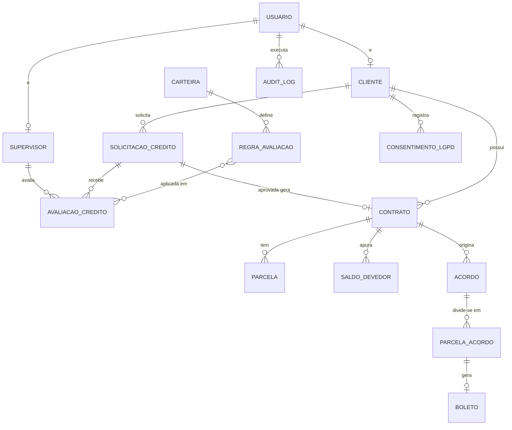
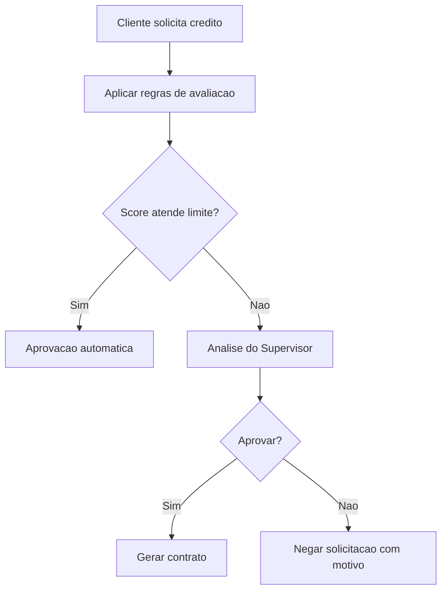

# ERD Expandido

## Entidades Principais

- Usuario
- Cliente
- Supervisor
- Carteira
- SolicitacaoCredito
- AvaliacaoCredito
- RegraAvaliacao
- Contrato
- Parcela
- SaldoDevedor
- Acordo
- ParcelaAcordo
- Boleto
- ConsentimentoLGPD
- AuditLog

## Diagrama ERD

## Fluxo de Avaliacao de Credito

