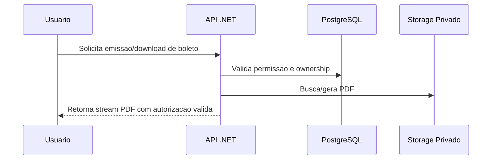

# Estrategia de Servico de PDF sem CDN

## Opcoes Avaliadas

## 1) PDF no PostgreSQL (bytea/LO)
- **Pro:** consistencia transacional simples.
- **Contra:** crescimento de banco e pior escala para alto volume de download.

## 2) Object Storage privado + metadados no PostgreSQL (recomendada)
- **Pro:** melhor escala para arquivos, retencao/versionamento nativos.
- **Contra:** adiciona componente operacional.

## 3) File system privado + metadados no PostgreSQL
- **Pro:** simples para inicio.
- **Contra:** desafios de backup e escala horizontal.

## Recomendacao

Adotar **Object Storage privado + PostgreSQL para metadados**, com download via endpoint autenticado no backend.

## Fluxo Seguro

## Checklist Minimo

- Validacao de ownership por usuario.
- Protecao contra path traversal.
- Criptografia em repouso e transito.
- Auditoria de download.
- Politica de retencao e descarte.
