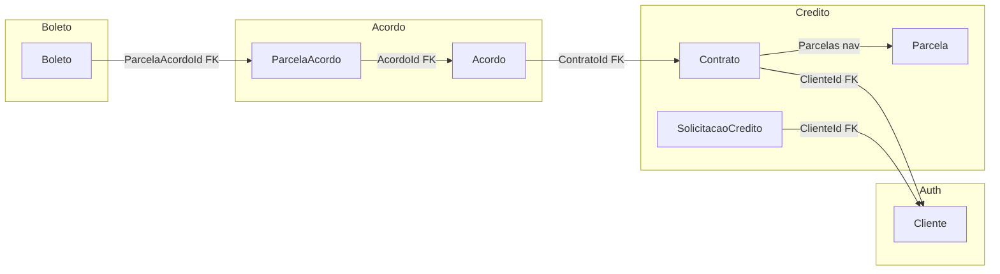
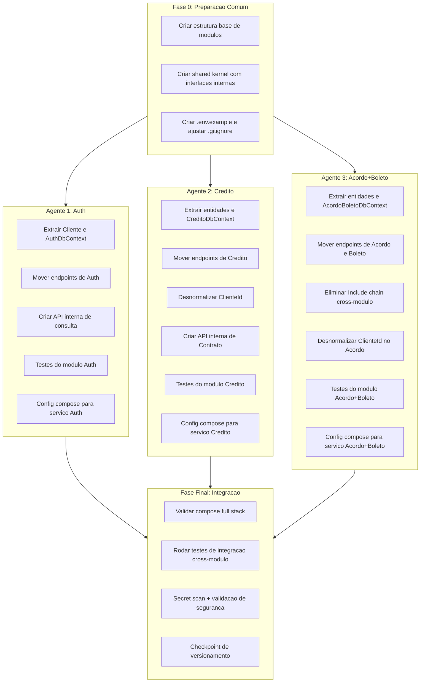

# Playbook: Orquestracao Multi-Modulo com Isolamento de Banco

## 1. Analise de Gaps para Integracao Inter-Banco

### 1.1 Gaps criticos identificados

**GAP-01: DbContext unico com navegacoes cross-dominio**
- `AppDbContext` registra todas as 7 entidades num unico contexto.
- Navegacoes cruzam fronteiras de modulo (ex: `Contrato.Parcelas`, `Acordo.Contrato`, `Boleto.ParcelaAcordo.Acordo.Contrato`).
- Impede separacao direta de banco por modulo sem quebrar queries.

**GAP-02: Cadeia de Include cross-dominio no endpoint de boleto**
- `Program.cs` L463-467: `.Include(x => x.ParcelaAcordo).ThenInclude(x => x.Acordo).ThenInclude(x => x.Contrato)` cruza Boleto -> Acordo -> Contrato (3 modulos).
- Essa query e impossivel num cenario de bancos separados sem API intermediaria.

**GAP-03: FK direta entre modulos sem contrato de integracao**
- `SolicitacaoCredito.ClienteId` -> tabela de outro modulo (Auth/Cliente).
- `Contrato.ClienteId` -> idem.
- `Acordo.ContratoId` -> cruza Acordo com Credito/Contrato.
- `Boleto.ParcelaAcordoId` -> cruza Boleto com Acordo.
- Nenhuma dessas relacoes passa por contrato de integracao ou evento.

**GAP-04: SeedData acoplado a multiplos modulos**
- `Data/SeedData.cs` insere `Cliente` + `Contrato` + `Parcelas` numa unica transacao.
- Assume acesso direto a tabelas de modulos diferentes.

**GAP-05: Autorizacao via navegacao cross-banco**
- `Program.cs` L362: `contrato.ClienteId != ObterIdUsuario(usuario)` -- requer dado do modulo Auth dentro do modulo Credito.
- `Program.cs` L475: `boleto.ParcelaAcordo?.Acordo?.Contrato?.ClienteId` -- cadeia de 4 entidades para checar ownership.

**GAP-06: Ausencia de estrategia de consistencia eventual**
- Toda operacao e transacional num unico banco. Criar acordo + parcelas + contrato roda em `SaveChangesAsync` unico.
- Separar bancos exige saga/outbox ou aceitar consistencia eventual.

### 1.2 Mapa de dependencia entre modulos (dados)

---

## 2. Mapa de Impacto no Codigo

### Perfil A: Separacao de DbContext por Bounded Context

| Ponto de impacto | Arquivo | Linhas |
|---|---|---|
| DbContext unico com 7 DbSets | `Data/AppDbContext.cs` | 8-14, 16-76 |
| DI do DbContext no pipeline | `Program.cs` | 46-57 |
| Todas as queries em Program.cs | `Program.cs` | 168-484 |
| SeedData acoplado | `Data/SeedData.cs` | 7-54 |
| Entidades num unico arquivo | `Domain/Entities.cs` | 3-93 |

**Abordagem A1 — Multi-DbContext no mesmo banco (schema isolation)**
- Criar `CreditoDbContext`, `AcordoDbContext`, `BoletoDbContext`, `AuthDbContext`, cada um com seus DbSets.
- Manter PostgreSQL unico mas com schemas separados (`credito`, `acordo`, `boleto`, `auth`).
- Cross-module: queries que cruzam modulos usam ID armazenado localmente + lookup via servico interno.
- Prós: menor disrupção, transacoes locais por modulo, preparacao para separacao fisica futura.
- Contras: ainda permite acoplamento via banco compartilhado se nao houver disciplina.

**Abordagem A2 — Banco fisico separado por modulo (full isolation)**
- Um PostgreSQL por modulo no compose (ou database separado na mesma instancia).
- Cada modulo tem seu proprio DbContext e connection string.
- Cross-module: obrigatorio usar API interna ou evento. `ClienteId` vira ID desnormalizado.
- Prós: isolamento real, preparacao para microservicos.
- Contras: complexidade operacional alta, necessidade de saga/outbox, mais containers.

**Abordagem A3 — Database-per-module logico (database isolation, instancia compartilhada)**
- Uma unica instancia PostgreSQL, porem databases separados (`carteira_auth`, `carteira_credito`, `carteira_acordo`, `carteira_boleto`).
- Cada DbContext aponta para seu database.
- Cross-module: mesma estrategia da A2 (servico ou evento), porem custo operacional menor (1 container PG).
- Prós: isolamento logico real com custo de infra baixo.
- Contras: cross-database query e possivel mas nao recomendado; exige disciplina equivalente a A2.

### Perfil B: Queries Cross-Dominio (Include chains)

| Ponto de impacto | Arquivo | Linhas | Modulos envolvidos |
|---|---|---|---|
| Include Boleto->ParcelaAcordo->Acordo->Contrato | `Program.cs` | 463-467 | Boleto, Acordo, Credito |
| Include Contrato->Parcelas | `Program.cs` | 351-354, 397 | Credito (interno) |
| Select com Parcelas.Count | `Program.cs` | 321-329, 334-341 | Credito (interno) |
| Where por ClienteId em SolicitacaoCredito | `Program.cs` | 247-261 | Credito -> Auth |
| Contrato.ClienteId para auth check | `Program.cs` | 362 | Credito -> Auth |
| Cadeia de ownership no boleto | `Program.cs` | 475-476 | Boleto -> Acordo -> Credito -> Auth |

**Abordagem B1 — Desnormalizacao de IDs + API Gateway interno**
- Cada modulo armazena localmente os IDs de referencia que precisa (ex: `Acordo` armazena `ClienteId` diretamente, nao navega via `Contrato`).
- Para ownership check, o modulo consulta uma API interna do modulo dono do dado.
- Prós: sem navegacao cross-banco, ownership explicito.
- Contras: desnormalizacao, risco de inconsistencia se nao sincronizar.

**Abordagem B2 — Domain Events + Read Model local**
- Quando um `Contrato` e criado, publica evento com `ClienteId`, `ContratoId`.
- O modulo `Acordo` consome e armazena um read model local (`ContratoResumo`) com `Id` + `ClienteId`.
- O modulo `Boleto` faz o mesmo para `AcordoResumo`.
- Prós: desacoplamento real, cada modulo e autonomo.
- Contras: consistencia eventual, necessidade de outbox/broker.

**Abordagem B3 — Composition API (BFF/Aggregator)**
- Um endpoint de composicao (ou o proprio API gateway) orquestra chamadas aos modulos para montar a resposta.
- Ex: `GET /api/boletos/{id}/pdf` chama modulo Boleto -> modulo Acordo -> modulo Credito -> verifica ownership.
- Prós: modulos puros, sem dependencia de dados cruzados.
- Contras: latencia de composicao, complexidade no aggregator.

### Perfil C: Configuracao e Infraestrutura

| Ponto de impacto | Arquivo | Linhas |
|---|---|---|
| Connection string unica | `appsettings.json` | 7 |
| Connection string no compose | `docker-compose.modulo.yml` | 12 |
| Build context unico (Dockerfile) | `Dockerfile` | 1-13 |
| Serilog labels fixos | `appsettings.json` | 61-70 |
| Frontend servido pelo backend | `Program.cs` | 144-157 |
| CORS aberto | `Program.cs` | 96-102 |

**Abordagem C1 — Configuracao por modulo via override de ambiente**
- Cada servico no compose recebe suas proprias env vars: connection string, Loki labels, porta.
- `appsettings.json` mantem defaults de dev; compose sobrescreve.
- Prós: minima alteracao no codigo, maximo controle no compose.
- Contras: explosion de variaveis de ambiente se muitos modulos.

**Abordagem C2 — Arquivo .env por modulo + appsettings por perfil**
- Criar `ops/env/credito.env`, `ops/env/acordo.env`, `ops/env/boleto.env`, etc.
- Compose referencia `env_file` por servico.
- `appsettings.{modulo}.json` para configuracoes especificas.
- Prós: organizado, auditavel, versionavel (sem segredos reais no repo).
- Contras: mais arquivos para manter.

**Abordagem C3 — Configuracao centralizada com .env.example + secret store**
- `.env.example` com todas as variaveis documentadas (sem valores reais).
- `.env` real no `.gitignore`.
- Compose usa `env_file: .env` + override por servico.
- Secret store (vault ou secrets do GitHub) para CI/CD.
- Prós: seguro, padrao de mercado, compativel com CI.
- Contras: requer setup inicial de vault/secrets.

### Perfil D: Testes e Seguranca

| Ponto de impacto | Arquivo | Linhas |
|---|---|---|
| Nenhum projeto de testes existe | — | — |
| QueryString logada em claro | `MiddlewareExcecaoGlobal.cs` | 50 |
| Credenciais em appsettings.json | `appsettings.json` | 7 |
| Credenciais no compose | `docker-compose.modulo.yml` | 12, 31-32 |
| Nenhum secret scanning | — | — |
| Nenhum pre-commit hook | — | — |

**Abordagem D1 — Projeto de testes por modulo + testes de arquitetura**
- Criar `tests/CarteiraBank.Tests.Unit/` e `tests/CarteiraBank.Tests.Integration/`.
- Testes de arquitetura (NetArchTest) para validar que modulos nao referenciam DbSets de outros modulos.
- Testes de seguranca: assert que logs nao contem patterns de token/senha.
- Prós: cobertura de regressao, fronteiras enforced por teste.
- Contras: investimento inicial de setup.

**Abordagem D2 — Testes inline com WebApplicationFactory + InMemory**
- Usar `WebApplicationFactory<Program>` para testes de integracao leves.
- Banco InMemory por teste, sem Docker.
- Assert em log output via `ITestOutputHelper` + Serilog test sink.
- Prós: rapido, sem dependencia externa, facil de rodar em CI.
- Contras: InMemory nao replica comportamento real do PostgreSQL.

**Abordagem D3 — Testcontainers + testes de integracao reais**
- Usar Testcontainers para subir PostgreSQL real por teste.
- Assert de queries reais, migrations, e comportamento de FK.
- Prós: fidelidade maxima, detecta bugs de SQL.
- Contras: mais lento, requer Docker no CI.

---

## 3. Playbook Segregado por Modulo

### 3.1 Modulo Auth (Cliente/Usuario)

**Responsabilidade:** identidade, autenticacao, perfil do cliente.
**Entidades:** `Cliente`.
**DbContext proprio:** `AuthDbContext` com `DbSet<Cliente>`.

**Alteracoes necessarias:**
- Extrair `Cliente` para namespace/projeto do modulo Auth.
- Criar `AuthDbContext` com OnModelCreating apenas para `Cliente`.
- Mover endpoint `GET /api/clientes/me` para namespace Auth.
- Mover `HeaderAuthenticationHandler` e config de JWT para namespace Auth.
- Expor API interna: `GET /internal/clientes/{id}/existe` e `GET /internal/clientes/{id}/resumo`.
- SeedData de Cliente vai para seed do modulo Auth.
- Testes: validar que Auth nao acessa tabelas de Credito/Acordo/Boleto.

### 3.2 Modulo Credito (Solicitacao + Contrato + Parcela)

**Responsabilidade:** ciclo de credito, avaliacao, contrato, parcelas.
**Entidades:** `SolicitacaoCredito`, `Contrato`, `Parcela`.
**DbContext proprio:** `CreditoDbContext`.

**Alteracoes necessarias:**
- Extrair entidades para namespace Credito.
- Criar `CreditoDbContext` com OnModelCreating para `SolicitacaoCredito`, `Contrato`, `Parcela`.
- Armazenar `ClienteId` como ID desnormalizado (sem FK para tabela de Auth).
- Mover endpoints: `POST /api/solicitacoes-credito`, `GET /api/solicitacoes-credito`, `POST /api/solicitacoes-credito/{id}/decisao`, `GET /api/contratos`, `GET /api/contratos/{id}/saldo-devedor`.
- Ownership check: usar `ClienteId` local (ja armazenado na entidade).
- Expor API interna: `GET /internal/contratos/{id}/resumo` (para modulo Acordo consultar `ClienteId`).
- SeedData de Contrato + Parcelas vai para seed do modulo Credito.
- Testes: validar isolamento, ownership, e nao-vazamento de dados sensiveis.

### 3.3 Modulo Acordo + Boleto

**Responsabilidade:** renegociacao, parcelas de acordo, emissao de boleto, PDF.
**Entidades:** `Acordo`, `ParcelaAcordo`, `Boleto`.
**DbContext proprio:** `AcordoBoletoDbContext`.

**Alteracoes necessarias:**
- Extrair entidades para namespace AcordoBoleto.
- Criar `AcordoBoletoDbContext` com OnModelCreating para `Acordo`, `ParcelaAcordo`, `Boleto`.
- Desnormalizar: `Acordo` armazena `ClienteId` diretamente (copiado do Contrato no momento da criacao).
- Substituir Include chain `Boleto->ParcelaAcordo->Acordo->Contrato` por lookup local (`Acordo.ClienteId`).
- Mover endpoints: `POST /api/contratos/{id}/acordos`, `POST /api/acordos/{id}/boleto`, `GET /api/boletos/{id}/pdf`.
- Para criar acordo, consultar API interna do modulo Credito: `GET /internal/contratos/{id}/resumo`.
- Ownership check do boleto: usar `Acordo.ClienteId` local em vez de navegar ate `Contrato`.
- Testes: validar que Include chain foi eliminada, ownership funciona sem cross-db, logs nao vazam dados.

---

## 4. Orquestracao para 3 Agentes Paralelos

### Visao geral

### Detalhamento por agente

**Fase 0 (sequencial, antes dos agentes):**
- Criar estrutura de diretorios por modulo.
- Criar `Shared.Kernel` com interfaces: `IClienteConsulta`, `IContratoConsulta`.
- Criar `.env.example` com todas as variaveis documentadas.
- Commit: `chore(structure): create module skeleton and shared kernel`.

**Agente 1 — Modulo Auth:**
- Escopo: `Cliente`, `AuthDbContext`, `HeaderAuthenticationHandler`, JWT config, endpoint `/api/clientes/me`, API interna, seed de cliente, testes.
- Arquivos que cria/modifica: `Modules/Auth/`, `docker-compose.modulo.yml` (servico auth), `appsettings.auth.json`.
- Nao toca em: entidades de Credito, Acordo, Boleto.
- Testes obrigatorios: isolamento de DbContext, endpoint de consulta, nao-vazamento de token em logs.

**Agente 2 — Modulo Credito:**
- Escopo: `SolicitacaoCredito`, `Contrato`, `Parcela`, `CreditoDbContext`, endpoints de credito, API interna de contrato, seed, testes.
- Arquivos que cria/modifica: `Modules/Credito/`, `docker-compose.modulo.yml` (servico credito), `appsettings.credito.json`.
- Nao toca em: entidades de Auth, Acordo, Boleto.
- Testes obrigatorios: ownership check, isolamento, nao-vazamento de dados sensiveis, desnormalizacao de ClienteId.

**Agente 3 — Modulo Acordo + Boleto:**
- Escopo: `Acordo`, `ParcelaAcordo`, `Boleto`, `AcordoBoletoDbContext`, endpoints de acordo e boleto, eliminacao de Include chain, testes.
- Arquivos que cria/modifica: `Modules/AcordoBoleto/`, `docker-compose.modulo.yml` (servico acordo-boleto), `appsettings.acordo-boleto.json`.
- Nao toca em: entidades de Auth, Credito (apenas consome API interna).
- Testes obrigatorios: ownership sem cross-db, Include chain eliminada, PDF sem vazamento de dados, secret scan.

### Regras de integracao entre agentes

- Nenhum agente modifica arquivo de outro modulo.
- Shared kernel e read-only para os 3 agentes (modificado apenas na Fase 0).
- Cada agente commita no trunk com prefixo de modulo: `feat(auth):`, `feat(credito):`, `feat(acordo-boleto):`.
- Fase final: integracao, validacao de compose, testes cross-modulo, secret scan.

### Ordem de commits por agente (trunk-based)

- Agente 1: `feat(auth): extract auth module with dedicated DbContext`
- Agente 2: `feat(credito): extract credit module with denormalized ClienteId`
- Agente 3: `feat(acordo-boleto): extract agreement and billing module`
- Integracao: `feat(orchestrator): wire multi-module compose and integration tests`
- Seguranca: `test(security): add anti-leak tests and secret scanning`

---

## 5. Recomendacao inicial

Para este MVP, a combinacao recomendada e:
- **Perfil A: Abordagem A3** (database-per-module logico) — isolamento real com custo baixo.
- **Perfil B: Abordagem B1** (desnormalizacao + API interna) — mais simples para o estagio atual.
- **Perfil C: Abordagem C2** (env por modulo + appsettings por perfil) — organizado e auditavel.
- **Perfil D: Abordagem D2** (WebApplicationFactory + InMemory) para inicio rapido, evoluindo para **D3** (Testcontainers) quando houver CI com Docker.

Estas escolhas podem ser revisadas antes da implementacao.
