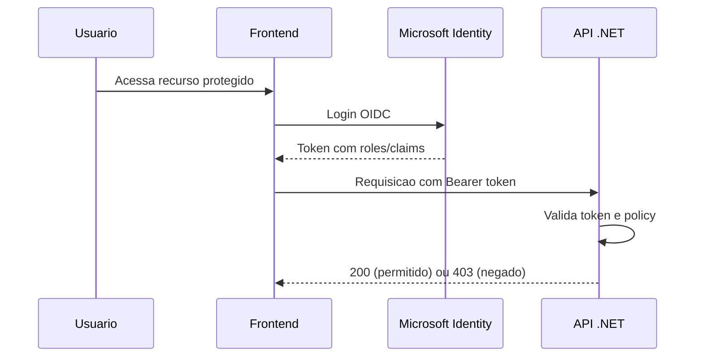

# Auth RBAC com Microsoft Identity

## Roles

- `Cliente`
- `SupervisorGestaoOperacoesCredito`

## Policies

- `PolicyCliente`
- `PolicySupervisorCredito`
- `PolicyCreditoLeitura` (Cliente ou Supervisor)
- `PolicyMesmoTitularOuSupervisor` (ownership ou papel de supervisor)

## Matriz de Permissoes (resumo)

- **Cliente:** consultar dados proprios, solicitar credito, consultar acordos/boletos proprios.
- **Supervisor:** consultar dados globais, avaliar solicitacoes, aprovar/negar credito, formalizar acordo.

## Fluxo de Autenticacao/Autorizacao

## Checklist de Implementacao

- Configurar `AddAuthentication` e `AddAuthorization`.
- Definir policies em `Program.cs`.
- Aplicar `[Authorize(Policy = \"...\")]` por endpoint.
- Validar ownership de recursos para evitar IDOR/BOLA.
- Garantir retorno correto: 401 vs 403.
